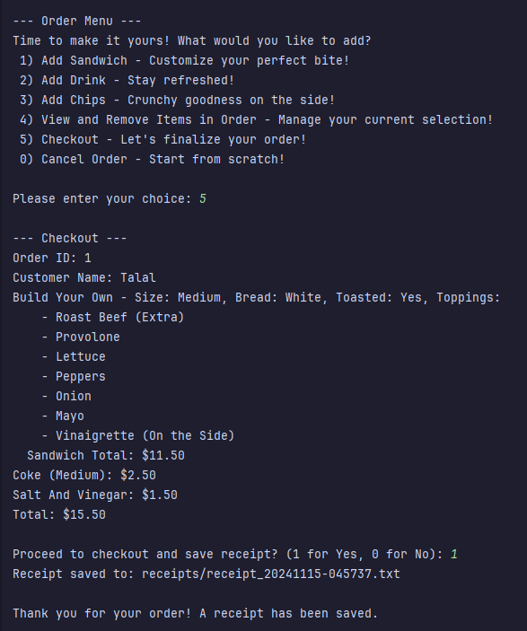

# The Deli Ordering System 🍽️

Welcome to **The Deli Ordering System**! This application is designed to streamline the process of creating and customizing sandwich orders. Built with Object-Oriented Programming (OOP) principles in Java, the system allows users to select signature sandwiches or build custom sandwiches, add sides and drinks, and finalize their orders with a detailed receipt.

---

## Table of Contents
- [Overview](#overview)
- [Features](#features)
- [Usage](#usage)
- [Project Structure](#project-structure)
- [Code Highlight](#code-highlight)
- [Key Concepts Demonstrated](#key-concepts-demonstrated)
- [Screenshots & Diagrams](#screenshots--diagrams)

---

## Overview

The Deli Ordering System is a user-focused application that aims to enhance the ordering experience for customers by providing an intuitive interface for sandwich customization. The application is built using core Java concepts, including enums, streams, and strong OOP principles, making it a versatile and modular project.

### Goals
1. **Easy Ordering**: Provide users with an easy-to-follow interface for customizing their orders.
2. **Extensibility**: Allow future addition of new items, toppings, and sandwich types with minimal code changes.
3. **Modular Codebase**: Use OOP principles for clear, maintainable code.

---

## Features

- **Order Creation**: Start a new order by entering your name and following the guided menu options.
- **Signature Sandwich Selection**: Choose from a list of signature sandwiches, each with its own default toppings.
- **Custom Sandwich Creation**: Build your own sandwich by selecting bread type, size, toast preference, and toppings.
- **Topping Customization for Signature and Custom Sandwiches**: Modify the preset toppings on signature sandwiches or add and remove ingredients freely when building a custom sandwich, ensuring every order meets the user's preferences.
- **Toppings Customization**: Add or remove toppings from your sandwich, with categories like Meat, Cheese, Veggies, and Condiments.
- **Side and Drink Options**: Add chips and a variety of drink options.
- **Checkout and Receipt**: View your order summary and save a receipt for future reference.

---

## Usage

Interact with **The Deli Ordering System** by starting a new order through the main menu. Follow the guided prompts to add signature sandwiches, customize your order, add sides and drinks, and view the final summary before checkout. The interface is designed to be intuitive, with clear options at each step for ease of use.

---

## Project Structure

The project is organized into a modular structure that keeps each component isolated and maintainable. Below is an overview of the main packages and classes:

- **com.ps.enums**: Contains various enums like `SandwichSize`, `BreadType`, `MeatType`, `CheeseType`, etc., which enhance readability and simplify the addition of new options.
- **com.ps.orders**: Manages the ordering process, including the `Order` class, which tracks items, and `ReceiptManager`, which generates and saves order receipts.
- **com.ps.products**: Houses the main product classes, such as `Product`, `Sandwich`, and `CustomSandwich`. Within the `signatures` subpackage, it contains predefined signature sandwiches like `BLT`, `MeatLovers`, and `ItalianSpecial`.
- **com.ps.toppings**: Contains all classes related to toppings, such as `Cheese`, `Condiments`, `Meat`, and `Veggies`, each with unique characteristics and pricing.
- **Main**: Contains the main entry point of the application.
- **UserInterface**: Handles user interactions, providing a command-line interface for customers to select and customize their orders.

The structure follows object-oriented principles, making it easy to extend or modify individual components without affecting the entire system. For example, adding a new type of signature sandwich only requires adding a new class in the `signatures` subpackage without modifying existing core classes.

---

## Code Highlight

The following are some essential classes and methods that drive the functionality of this project:

- **UserInterface**: The main user-facing class, responsible for handling user input, displaying options, and managing the order process.
- **Order**: Maintains the list of items in a user's order, calculates the total, and provides summary methods.
- **Sandwich**: An abstract class for sandwiches, allowing customization and extension for different types.
- **ReceiptManager**: Generates and saves a receipt file with a summary of the user's order.

### Interesting Code Segment: `getEnumChoice`

One of the most interesting and versatile methods in this project is `getEnumChoice`. This method is used when customers are selecting customizable options such as bread type or sandwich size, providing a consistent and dynamic way to handle user choices. This method allows for dynamic selection from any enum, making the code reusable for various selection tasks like choosing bread types, sizes, or toppings.

```java
private <T extends Enum<T>> T getEnumChoice(T[] options, String toppingType) {
    int choice;
    do {
        System.out.println("\n--- Select " + toppingType + " ---");
        for (int i = 0; i < options.length; i++) {
            System.out.println(" " + (i + 1) + ") " + options[i].toString());
        }
        System.out.println(" 0) Done with " + toppingType.toLowerCase() + "!");

        System.out.print("\nPlease enter your choice: ");
        try {
            choice = cmdscnr.nextInt();
            cmdscnr.nextLine();

            if (choice == 0) return null;
            if (choice > 0 && choice <= options.length) {
                return options[choice - 1];
            } else {
                System.out.println("\nOops! That's not a valid choice. Please try again.\n");
            }
        } catch (Exception e) {
            System.out.println("\nOops! That's not a valid choice. Please try again.\n");
            cmdscnr.next();
        }
    } while (true);
}
```

This method showcases the use of Java generics, enum handling, and dynamic user interaction, making it a core piece of the application’s functionality.

---

## Key Concepts Demonstrated

This project leverages a variety of advanced programming concepts, including:

- **Scalability**: The modular design ensures that new features, like additional toppings or new sandwich types, can be added with minimal changes to the existing codebase.
- **Object-Oriented Programming (OOP)**: The application is structured using core OOP principles, with classes such as `Sandwich`, `Order`, and `ReceiptManager`. Each class represents a specific aspect of the deli ordering process, ensuring modular and maintainable code.
- **Enums**: The application uses enums to handle fixed sets of constants, such as `BreadType`, `DrinkType`, and `CondimentType`, which makes the code more readable and less error-prone by constraining values to predefined options.
- **Java Streams and Collections**: Through the use of collections and Java streams, the code efficiently manages and processes lists of items, such as toppings and orders.
- **Error Handling**: The application includes robust error handling to enhance the user experience by validating inputs and providing helpful messages for invalid entries.

---

## Screenshots & Diagrams

Below are some screenshots of the application in action:

**Main Menu**: Main menu where users start a new order or exit, showing clear navigation options.
   


**Order Menu**: Order menu where users add sandwiches, drinks, or chips, view items, and checkout, illustrating the different steps in the ordering process.
   


**Checkout Menu**: Checkout menu where users finalize their order, view a summary, and confirm payment, ensuring they review all items before completing the purchase. Order menu where users add sandwiches, drinks, or chips, view items, and checkout, illustrating the different steps in the ordering process.
   


**Receipt**: Screenshot of the generated receipt, providing an overview of the ordered items, their prices, and the final total cost.
   


### GIF of the Application in Action

**Application Demo GIF**: A brief demonstration of adding a sandwich with customizations to an order, showing the step-by-step process of selecting bread type, toppings, and other customizations.


### Class Relationship Diagram

**Diagram**: A visual representation of the relationship between the main classes. This will help illustrate how each part of the system interacts and supports modular design.


All related files, including screenshots and diagrams, are available in the assets folder for easy reference.